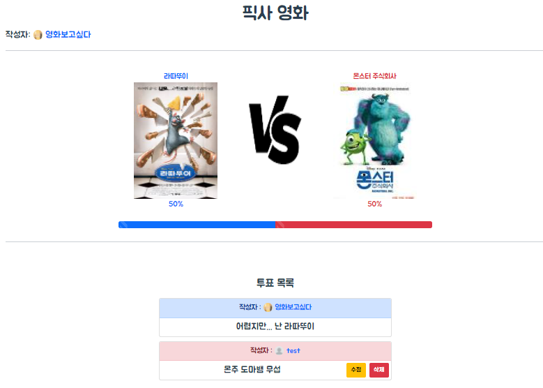

# Final Project

## 팀 정보

### 팀명

- 오늘 같은 날엔

### 구성원

- 팀장: 이종현
- 팀원: 권수린

---

## 역할

#### 공통

- 모델 구성
- url 구성
- 화면 구성

#### 이종현

- movies app 전담
  - 날씨 데이터와 영화 데이터를 받아와 해당 날씨에 맞는 영화 추천 로직 작성
  - 랜덤 영화 추천 로직 작성
  - 리뷰 작성, 수정, 삭제 로직 작성
- 디자인 전반
- 발표자료 준비 및 발표

#### 권수린

- versus app 전담
  - 게시글 생성, 삭제 로직 작성
  - 댓글 생성, 수정, 삭제 로직 작성
- 유저 프로필 수정 로직 작성
- Vue 작업 전반
  - 컴포넌트 구성 
  - vuex를 이용한 데이터 관리
- 디자인 보조

---

## 목표 서비스 구현

### 주제

- 날씨 기반 영화 추천 사이트

### 목표 기능

- 오늘 날씨 데이터를 기반으로 한 영화 추천
- 각 날씨별(임의로 정한 5가지 날씨) 영화 추천
- 랜덤 영화 추천
- 두 영화(혹은 영화 관련 내용)를 비교하는 커뮤니티
- 영화 리뷰 작성

### 실제 구현

- 90% 이상
- 기능만 봤을 땐 목표한 기능이 모두 작동하지만 디테일한 부분에서는 약간 미숙한 부분이 있다. 하지만 개발해가면서 처음에는 생각하지 않았던 부분을 발전시키기도 했기 때문에 목표한 대로 잘 구현한 것 같다.

---

## ERD

---

## 기능

### 오늘 날씨 기반 영화 추천

- 날씨를 5가지(맑음, 구름, 비, 눈, 흐림)로 분류 및 각 날씨에 해당하는 영화 장르 정의
- 날씨 데이터를 받아와 분류한 날씨 중 어디에 속하는지 결정
- 여러 영화 데이터를 받아와서 해당 날씨에 맞는 장르의 영화 필터링
- 총 5개의 영화 추천

### 날씨별 영화 추천

- 날씨 아이콘을 누르면 영화 데이터를 받아와 각 날씨에 해당하는 장르의 영화 5개 추천

### 랜덤 영화 추천

- 영화 데이터를 받아와서 랜덤으로 한 개의 영화 추천

### 영화 관련 유튜브 영상 제공

- 영화 디테일 페이지에서 영화와 관련된 유튜브 영상 5개 제공
- 썸네일 클릭시 새로운 페이지로 리다이렉트

### 영화 리뷰

- 영화 리뷰 작성, 수정, 삭제 기능
- 별표를 눌러서 평점 부여 가능(최저 0.5점)
- 유저 이름 클릭시 프로필로 이동

### 영화 대 영화 커뮤니티

- 투표 게시글을 작성 및 투표 기능
- 투표는 인당 한 번만 가능

- 자신이 작성한 댓글만 수정 및 삭제 가능

### 유저 프로필

- 사진 및 자신에 대한 설명 추가 기능
- 작성한 리뷰, 게시글, 댓글 확인

---

## 후기

### 이종현

- 다양한 곳에서 api를 요청하고, 데이터를 수집하여내가 원하는 데이터로 정제 하는 것이 

  재밌었습니다!코딩 하는 것에 대해 어려움이 있었지만,

  같은 페어로 된 수린님 덕에 잘 해결 할 수 있었습니다.

  이번 프로젝트를 통해서 개발자로서, 한 층 더 성장 할 수 있어서 만족합니다!

### 권수린

- 기획부터 개발까지 한 프로젝트는 처음이어서 힘들었지만 재밌었다. 배운 것만 활용해서 만들었기 때문에 특출나지는 않지만 잘 만들기 위해 노력했기 때문에 값진 프로젝트였다. 개발하면서 초기에 구상했던 것과 달라져서 중간에 로직을 수정하기도 하고 기능을 발전시키기도 하는 과정이 재미있었고 이를 통해 좀 더 성장할 수 있었던 것 같다.